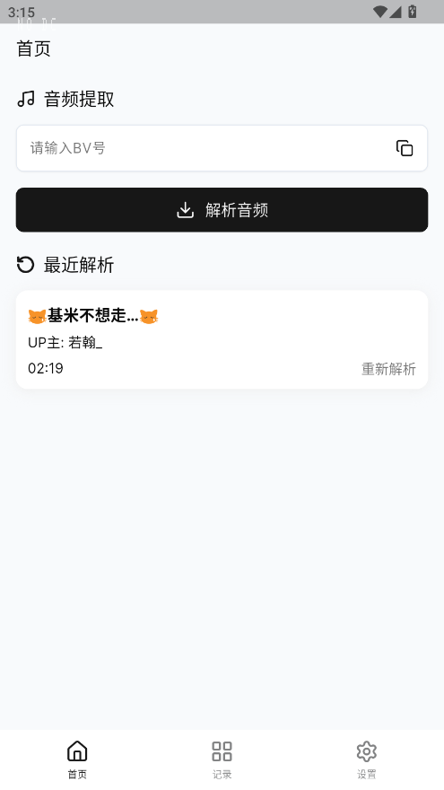
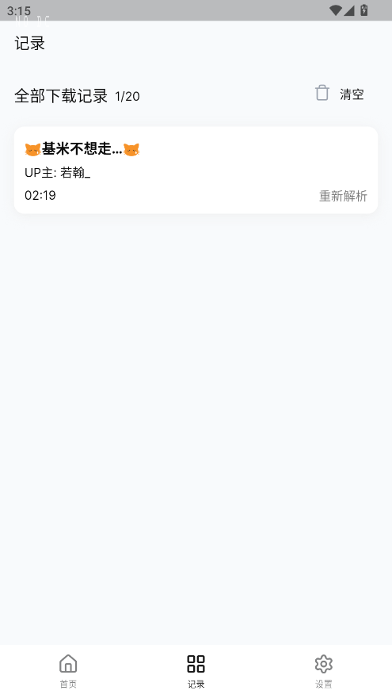
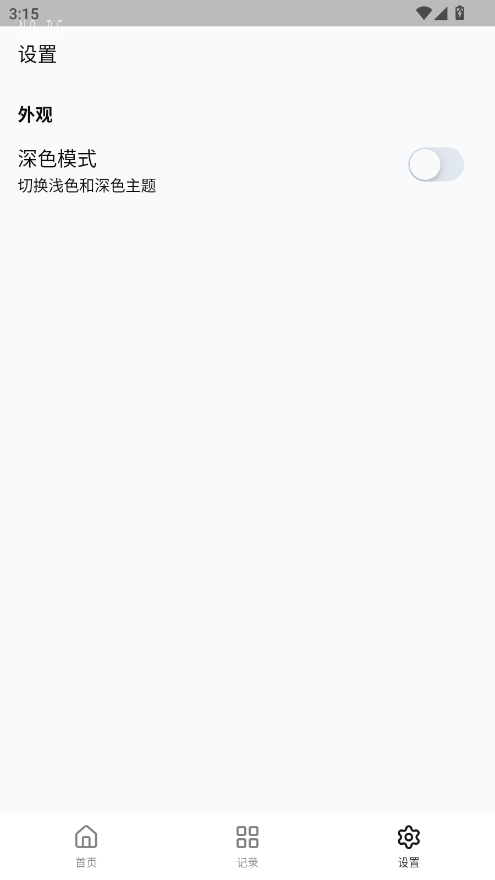

# Bilibili Audio Downloader

一个简单的 Flutter 桌面应用，用于提取和下载 Bilibili 视频的音频。

## 功能

- 输入 BV 号提取 Bilibili 视频音频
- 查看下载历史记录
- 深色/浅色主题切换
- 本地保存下载记录（最多 20 条）

## 技术栈

| 技术 | 版本 | 用途 |
|------|------|------|
| Flutter SDK | ^3.10.7 | 跨平台框架 |
| ForUI | ^0.17.0 | UI 组件库 |
| GetX | ^4.7.3 | 状态管理 |
| path_provider | ^2.1.1 | 获取系统路径 |
| permission_handler | ^11.0.1 | 权限管理 |
| shared_preferences | ^2.5.4 | 本地存储 |
| bot_toast | ^4.1.3 | 消息提示 |
| external_path | ^2.2.0 | 跨平台路径获取 |

## 目录结构

```
lib/
├── main.dart              # 应用入口
├── models/
│   └── Video.dart         # 视频数据模型
├── pages/
│   ├── home/              # 首页（音频提取）
│   ├── history/           # 下载历史
│   └── settings.dart      # 设置页面
├── stores/
│   └── history_store.dart # 历史记录状态
├── theme/
│   ├── brand.dart         # 主题颜色
│   └── theme_controller.dart # 主题控制器
└── utils/
    ├── AudioDownloader.dart # 音频下载逻辑
    ├── FileUtil.dart       # 文件操作
    └── ToastUtil.dart      # 提示工具
```

## 使用方法

1. 在首页输入框输入 Bilibili 视频的 BV 号（如 `BV1pf421S7wv`）
2. 点击「解析音频」按钮
3. 音频将自动下载到设备
4. 可在「记录」页面查看历史下载记录

## 项目截图
|    |  |  |
|-----------------------------------------------------|----------------------------------------------------| -------------------------------------- |

## 运行

```bash
flutter pub get
flutter run
```
